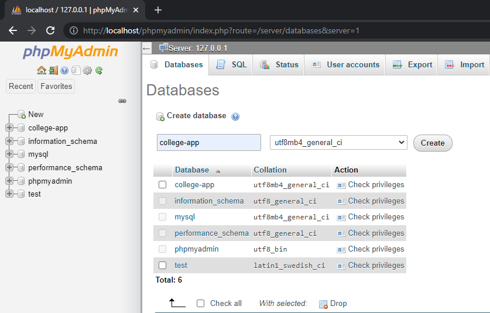
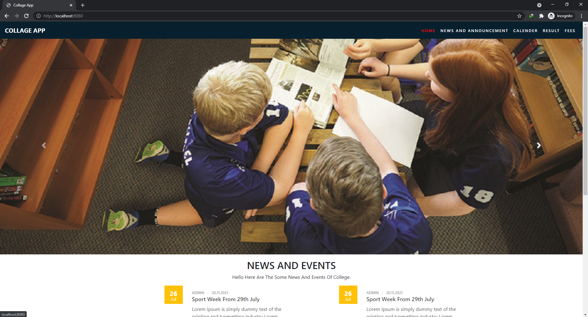

# College-app 
```
[spring boot,thymeleaf templete,spring web,sql,jpaRepository,Spring security]
```
# 1)Clone project open in any IDE
```
(eclipse ,netbean,intellij)
it is mavin project
```
```
https://github.com/Jit-Bdr-Rana/collage-app.git
```
# 2)Open and create database in localhost xampp with name
```
college-app
```
             

# 3)Open src/main/resources/applicatin.properties setup your database
```
spring.datasource.url=jdbc:mysql://localhost:3306/college-app
spring.datasource.username=root
spring.datasource.password=
```
                 

# 4)Go to com.college run this file 
```
application.java 
```

# 5)Open browser with 
#### User Side
```
http://localhost:8080  
```
                  


#### AdmnPannel

```
http://localhost:8080/admin/login  
```
              

# 6)Default admin login 
#### Username
```
admin@gmail.com
```
#### Password
```
admin
```
                   

  
# 7) Screen shot
### Index

### Calender

### Fee

### Result

### Backend Index


<br>

  <p> visit link for documentation: 
  https://github.com/Cronic7/Documentation_collegeapp</p>
  
  
  <p>Special thanks to <a href="https://github.com/anupjungkarki">anup karki</a> for User Interface design 
  https://github.com/anupjungkarki/College-App-Fontend</p>

  
  <p>Special thanks to Seazone Joshi for his experties in various field and his guidance</p>

